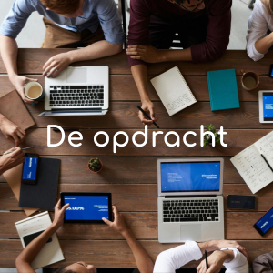

# WailSalutem Workshopportaal



Webapplicatie voor de WailSalutem Foundation, gebouwd door team Nexus-IT. Met deze applicatie beheert WailSalutem workshops, koppelt trainers en vrijwilligers aan sessies, laat deelnemers zich inschrijven via een openbaar formulier en exporteert rapportages voor sponsors.

**Live applicatie:** https://nexus-it-wailsalutem.nl

---

## Wat doet deze applicatie?

- **Workshops aanmaken en beheren:** voeg workshops toe, pas ze aan of verwijder ze.
- **Aanmeldingen bijhouden:** zie wie zich heeft aangemeld voor een workshop.
- **Agenda bekijken:** een overzicht van alle geplande workshops.
- **Trainers en vrijwilligers beheren:** voeg accounts toe en stel hun rechten in.
- **Dashboard raadplegen:** een snelle samenvatting per rol.
- **Sponsorrapportages exporteren:** als PDF en als Excel.

Bezoekers kunnen zonder account de openbare catalogus bekijken en zich aanmelden voor een workshop.

---

## Rollen

| Rol | Wat kan deze rol |
|-----|------------------|
| admin | Alles: workshops, accounts, sponsors, aanmeldingen |
| trainer | Eigen workshops bekijken en bijwerken, aanmeldingen op eigen workshops inzien |
| vrijwilliger | Inloggen en de catalogus bekijken |
| publiek (geen account) | Catalogus bekijken en zich aanmelden |

De toegangscontrole loopt via de `role_required`-decorator in `app/decorators.py`. Wie geen geldige rol heeft voor een route, krijgt een 403-pagina te zien.

---

## Productieomgeving

De applicatie draait op een Strato VPS (Ubuntu 24.04) in twee Docker-containers:

- **wailsalutem-web:** Flask met Gunicorn (3 workers) op Python 3.11
- **wailsalutem-db:** MySQL 8.0 met een persistent volume (`db_data`)

NGINX op de host staat voor de containers en handelt HTTPS af met een Let's Encrypt-certificaat. Verkeer op poort 80 wordt automatisch doorgestuurd naar HTTPS. Een GitLab CI/CD-pipeline rolt elke push naar de `main`-branch automatisch uit naar de VPS.

Het onderhoud, de beveiliging en de afspraken na overdracht staan beschreven in de SLA.

---

## Lokaal opstarten (voor ontwikkelaars)

### Benodigdheden

- [Python 3](https://www.python.org/downloads/)
- [Git](https://git-scm.com/)
- [Docker Desktop](https://www.docker.com/products/docker-desktop/) (voor optie 1)

### Optie 1: Docker (aanbevolen)

Docker zet alles automatisch klaar. Je hoeft Python of de database niet zelf in te stellen.

```bash
# 1. Zet de instellingen klaar
cp .env.example .env
# Open .env en vul de waarden in (vraag een teamgenoot om de juiste waarden)

# 2. Start de applicatie
docker compose up --build
```

De applicatie is daarna bereikbaar op **http://localhost:5001**.

Stoppen doe je met `Ctrl + C`, daarna `docker compose down`.

### Optie 2: handmatig

```bash
# 1. Project binnenhalen
git clone <github-repo-url>
cd faaciiweedee14

# 2. Virtuele omgeving aanmaken en activeren
python -m venv .venv
source .venv/bin/activate        # Mac/Linux
.venv\Scripts\activate           # Windows

# 3. Benodigde pakketten installeren
pip install -r requirements.txt

# 4. Instellingen klaar zetten
cp .env.example .env
# Vul .env in

# 5. Applicatie starten
python run.py
```

De applicatie is daarna bereikbaar op **http://localhost:5000**.

---

## Eerste keer opstarten: admin-account

Bij de allereerste start maakt de applicatie automatisch een admin-account aan. Het wachtwoord verschijnt eenmalig in de logs. Bekijk de logs met:

```bash
docker compose logs web
```

Noteer dit wachtwoord en log er direct mee in.

---

## Tests uitvoeren

Om te controleren of alles nog correct werkt na een aanpassing:

```bash
pytest
```

---

## Projectstructuur (kort overzicht)

```
faaciiweedee14/
├── app/                  # De broncode van de applicatie
│   ├── login/            # Inloggen, uitloggen, registratie
│   ├── dashboard/        # Startpagina per rol
│   ├── workshops/        # Beheer van workshops
│   ├── agenda/           # Tijdlijn van geplande workshops
│   ├── gebruikers/       # Beheer van trainer- en vrijwilliger-accounts
│   ├── publiek/          # Openbare catalogus
│   ├── aanmeldformulier/ # Inschrijving zonder account
│   ├── sponsors/         # Rapportages en exports
│   └── decorators.py     # role_required toegangscontrole
├── docs/                 # Documentatie (ERD, class diagram, use case, handleiding)
├── Dockerfile            # Voor het bouwen van de Docker-image
├── docker-compose.yml
├── requirements.txt      # Lijst met gebruikte softwarepakketten
└── run.py                # Startpunt van de applicatie
```

---

## Meer documentatie

In de map `docs` staan het ERD, het class diagram, het use case diagram, een installatiehandleiding en het code review-protocol. De afspraken over onderhoud, beveiliging en beschikbaarheid na de overdracht staan in de SLA.

---

## Vragen of problemen?

Meld een probleem als issue in de repository. Bij vragen over de productieomgeving: zie de SLA en het infrastructuurverslag.

---

*Gebouwd door team Nexus-IT voor de WailSalutem Foundation.*